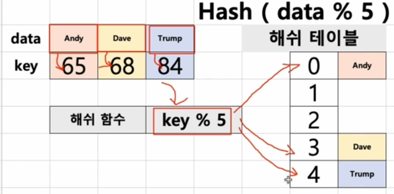
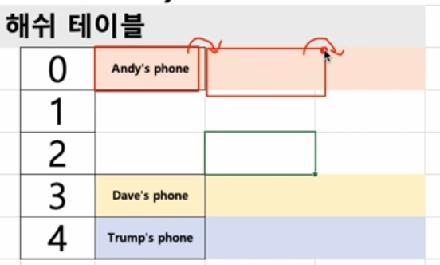
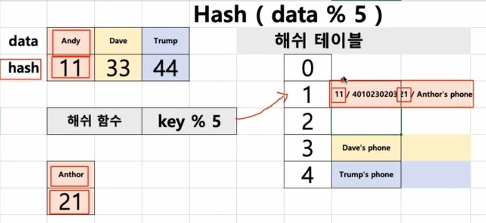
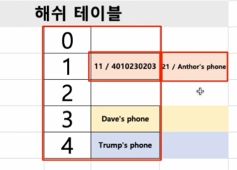
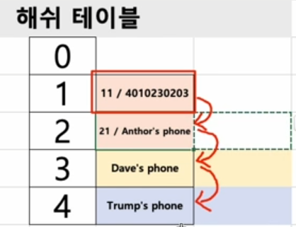
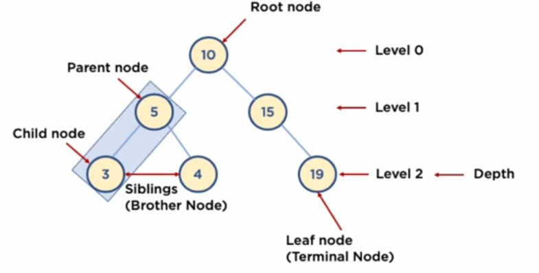
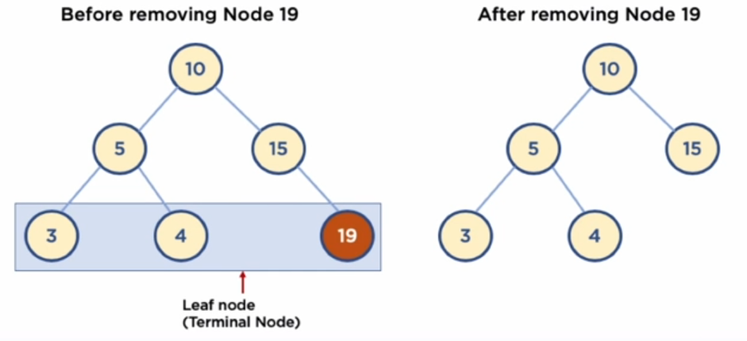
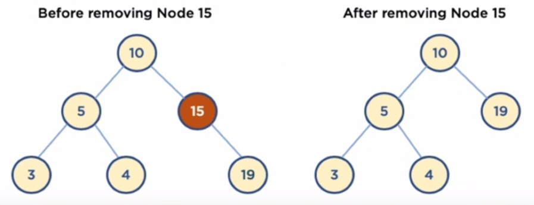
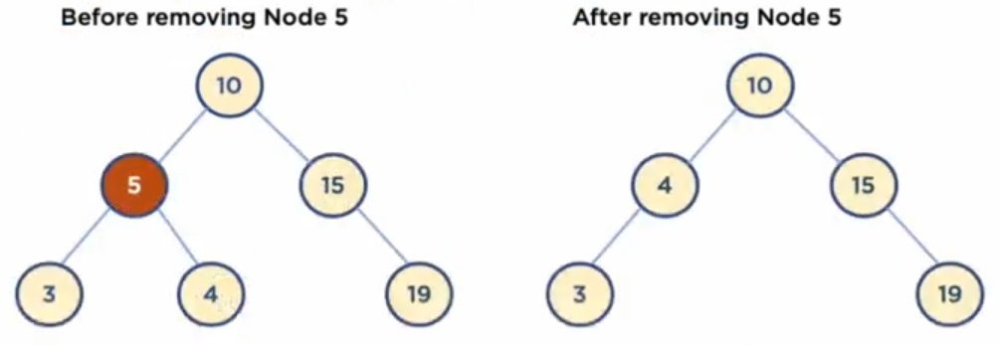

# 알고리즘 복잡도 표현 방법
## 1. 알고리즘 복잡도 계산이 필요한 이유

- 하나의 문제를 푸는 알고리즘은 다양할 수 있다. 
  - so, 다양한 알고리즘 중 어느 알고리즘이 더 좋은지를 분석하기 위해, 복잡도를 정의하고 계산한다.

## 2. 알고리즘 복잡도 계산 항목

- 시간 복잡도 : 알고리즘 실행 속도
- 공간 복잡도 : 알고리즘이 사용하는 메모리 사이즈

> 최근에는 가장 중요한 시간 복잡도를 이해하고 계산해야 한다.


## 알고리즘 시간 복잡도의 주요 요소

> 반복문이 중요한 요소이다 !
> 알고리즘에서 가장 시간이 많이 걸리는 요소는 반복문이다.


## 알고리즘 성능 표기법
- 빅오 표기법 O(N)
  - 최악의 실행 시간을 표기 (아무리 최악이라도 이정도의 성능은 보장한다는 의미)
  - 일반적으로 가장 많이 사용 됨
  - O(1), O(log n), O(n) 등


- 오메가 표기법
  - 최상의 실행 시간 표기 
- 세타 표기법
  - 평균 실행 시간 표기

------


# 배열 ( Array )

- 데이터를 나열하고, 각 데이터를 인덱스에 대응하도록 구성한 데이터 구조
- 파이썬에서는 리스트 타입이 배열 기능을 제공함.


## 1. 배열이 왜 필요할까?

- 같은 종류의 데이터를 효율적으로 관리하기 위해 사용
- 순차적으로 저장

### 1) 장점 & 단점
- 빠른 접근 가능 (인덱스로) 
- 추가/삭제가 쉽지 않다.( 인덱스 재정렬을 해주거나, 큰 사이즈의 배열을 새롭게 선언해서 옮겨줘야 함 )
- 미리 최대 길이를 지정해줘야 한다.


## 2. 파이썬과 배열

- 파이썬 리스트 활용 ( 파이썬에선 리스트가 배열 기능을 제공하기 때문 )

```python
# 1차원 배열 : 리스트로 구현시
data = [1,2,3,4,5]
```

```python
# 2차원 배열 : 리스트로 구현시
data = [[1,2,3,4,5],[4,5],[6,7,8,9]]
```


------------------


# 큐 ( Queue )

## 1. 큐 구조

- FIFO (First-In, First-Out)
- ```멀티 태스킹을 위한 프로세스 스케쥴링 방식을 구현``` 하기 위해 많이 사용됨
  - 큐의 경우, 장단점 보다는 큐의 활용 예시로 프로세스 스케쥴링 방식을 이해해두는게 좋음.


## 2. 알아둘 용어

- Enqueue
- Dequeue
- Visualgo(동작 방식 시각화): https://visualgo.net/en/list

## 3. 파이썬  queue 라이브러리를 사용해서 큐 자료 구조 사용하기.

### - 3.1 Queue() 로 큐 만들기
```python
import queue

data_queue = queue.Queue()
```

- Enqueue, Dequeue
```python
data_queue.put("data")

data_queue.get()
```

### - 3.2 LifoQueue() 로 큐 만들기(LIFO)
```python
import queue

data_queue = queue.LifoQueue()
```


### - 3.3 PriorityQueue() 로 큐 만들기 (우선 순위 큐)

```python
import queue

data_queue = queue.PriorityQueue()
```
```
data_queue.put((우선순위, data)) 
```


### - 4. List 로 Queue 구현하기

- Queue 를 구현할때 기본적으로 구현해야 하는 기능은 Enqueue 와 Dequeue 다.

```python

queue_list = list()

def Enqueue(data, list):
  list.append(data)
  
def Dequeue(list):
  
  first_data = list[0]
  del list[0]
  return first_data

```


-----------------------
# 스택 (Stack)

## 1. 스택 구조

- LIFO ( Last-In First-Out )
- 대표적으로 브라우저의 콜스택에서 사용된다.
- 주요 기능
  - push() 
  - pop() 
- Visualgo(동작 방식 시각화): https://visualgo.net/en/list


## 2. 스택 구조와 콜 스택
- 스택은 브라우저의 콜 스택에서 사용됨.


## 3. 스택 구조의 장단점
- 장점
  - 구조가 단순하고 구현이 쉽다
  - 저장/읽기 속도가 빠르다
  
- 단점
  - 데이터의 최대 갯수를 미리 정해야 한다.
    - 저장 공간의 낭비가 발생할 수 있다.
    - 파이썬의 경우 재귀 함수는 1000번 까지만 호출이 가능함.
  


## 4. 파이썬 리스트 기능에서 제공하는 기능으로 스택 사용해보기
- 파이썬 list 에서 append (인덱스 맨 뒤에 데이터를 추가) 와 
  pop (맨 뒤에 데이터를 제거) 하는 함수를 기본적으로 제공함.

```python
data_stack = list()

data_stack.append(1)
data_stack.append(2)
# data_stack = [1,2]

data_stack.pop()
# 2
# data_stack = 1
```


----------------------

#링크드 리스트 (Linked List)

## 1. 구조
- 연결 리스트라고도 함.
- 일종의 배열의 단점(크기가 고정되어 있음)을 보완한 자료구조이다.
- 물리적(메모리상)에서는 각 데이터들이 떨어져있지만, 개념적으로 연결 되어있는 형태이다.
- 노드(Node) : 데이터 저장 단위(데이터값, 포인터) 로 구성
- 포인터(pointer) : 각 노드 안에서 다음이나 이전 노드와의 연결 정보를 가지고 있는 공간(주소 값)


## 2. 간단한 링크드 리스트 예
```python
class Node:
    def __init__(self, data, next=None):
        self.data = data
        self.next = next
```
- Node와 Node 연결하기 (포인터 활용)

```python
node1 = Node(1)
node2 = Node(2)
node1.next = node2
head = node1
```

- 링크드 리스트로 데이터 추가하기

```python
class Node:
    def __init__(self, data, next=None):
        self.data = data
        self.next = next

def add(data):
    node = head
    while node.next:
        node = node.next
    node.next = Node(data) 
```
```python
node1 = Node(1)
head = node1
for index in range(2, 10):
    add(index)
```

- 링크드 리스트 데이터 출력하기(검색하기)

```python
node = head
while node.next:
    print(node.data)
    node = node.next
print (node.data)
```


## 3. 링크드 리스트 장, 단점

장점 - 배열 처럼 미리 크기를 정해 놓을 필요가 없기 때문에, 동적이다.
    
단점 - 배열은 인덱스로 임의 접근이 가능, but , 링크드 리스트는 앞에서 부터 순차적으로 찾아야 하기 때문에, 접근 속도가 느리다.
    - Node 에 Value 뿐만 아니라 Pointer 도 저장하기 때문에, 배열에 비해 저장공간 효율이 좋지 않다.
    - 중간 데이터 삭제시, 앞뒤 데이터의 연결을 해줘야 하는 부가적인 작업이 필요하다.


## 4. 링크드 리스트에서 구현해야 할 기능1 (중간에 데이터 추가하기)


```python
node = head
while node.next:
    print(node.data)
    node = node.next
print (node.data)
```
```python
node3 = Node(1.5)

node = head
search = True
while search:
    if node.data == 1:
        search = False
    else:
        node = node.next

node_next = node.next
node.next = node3
node3.next = node_next
```


## 파이썬으로 링크드 리스트 구현하기

```python
class Node:
    def __init__(self, data, next=None):  
        self.data = data
        self.next = next

class NodeMgmt:
    def __init__(self, data):
      self.head = Node(data)

    
  
    def add(self, data):
      if self.head == '':
        self.head = Node(data)
      else:
        node = self.head
        while node.next:
          node = node.next
        node.next = Node(data)

def desc(self):
    node = self.head
    while node:
      print(node.data)
      node = node.next

```

```python
linkedlist1 = NodeMgmt(0)
linkedlist1.desc()
### 0

for data in range(1,10):
    linkedlist1.add(data)

linkedlist1.desc()

###0
###1
###2
###....
```


#### 링크드 리스트 삭제 기능 구현

링크드 리스트에서 삭제 되는 Case 는 총 세 가지이다.

1. head 삭제
2. rear 삭제
3. 중간 데이터 삭제


```python
def delete(self, data):
     
     # 방어코드
    if self.head == '',
        print("해당 노드 값이 없습니다.")
        return
        
    
     # head 삭제 시
     if self.head.data == 'data':
         temp = self.head
         self.head = self.head.next
         del temp
     else:
     
     # rear 및 중간 데이터 삭제 시     
         node = self.head
         while node.next:
             if node.next.data == data:
                 temp = node.next
                 node.next = node.next.next
                 del temp
        
```


## 다양한 링크드 리스트 종류


- 더블 링크드 리스트(Doubly linked list)
  - 기본적인 링크드 리스트의 단점 중 하나로, 
    데이터를 탐색 할 때, 맨 앞에서 부터 탐색해야 한다는 점이 있다.
    이를 보완하는 데이터 구조로, 더블 링크드 리스트가 있다.
  - 이중 연결 리스트라고도 한다.
  - 양방향으로 연결되어 있어서, 노드 탐색이 양쪽으로 모두 가능하다.


```python
class Node:

    def __init__(self, data, prev=None, next=None):
        self.prev = prev
        self.data = data
        self.next = next


class NodeMgmt:
    
    def __init__(self, data):
        self.head = Node(data)
        self.tail = self.head
        
    def insert(self, data):
      if self.head == None:
        
        self.head = Node(data)
        self.tail = self.head
        
      else:
        node = self.head
        while node.next:
          node = node.next
        new = Node(data)
        new.prev = node
        self.tail = new
        
      def desc(self):
        node = self.head
        while node:
          print(node.data)
          node = node.next


```

-------


# 해쉬 테이블 (Hash Table)

## 1. 해쉬 구조

- Hash Table : 키(Key) 에 데이터(Value) 를 저장하는 데이터 구조
  - key를 통해 바로 접근 가능, 속도가 빠르다
  - 파이썬 딕셔너리(Dictionary) 타입이 해쉬 테이블
  - 배열로 미리 Hash Table 사이즈만큼 생성 후에 사용

## 2. 알아둘 용어

- 
- 해쉬(Hash): 임의 값을 고정 길이로 변환하는 것
- 해쉬 테이블(Hash Table): 키 값의 연산에 의해 직접 접근이 가능한 데이터 구조 
- 해싱 함수(Hashing Function): Key에 대해 산술 연산을 이용해 데이터 위치를 찾을 수 있는 함수
- 해쉬 값(Hash Value) 또는 해쉬 주소(Hash Address): Key를 해싱 함수로 연산해서, 해쉬 값을 알아내고, 이를 기반으로 해쉬 테이블에서 해당 Key에 대한 데이터 위치를 일관성있게 찾을 수 있음
- 슬롯(Slot): 한 개의 데이터를 저장할 수 있는 공간
- 저장할 데이터에 대해 Key를 추출할 수 있는 별도 함수도 존재할 수 있음


## 3. 간단한 해쉬 예

### 3.1 hash table 만들기

```python
hash_table = list([i for i in range(10)])
print(hash_table)
```


### 3.2 Division 방법 (나누기를 통한 나머지 값을 사용하는 기법)으로 해쉬 함수 만들기

```python
def hash_func(key):
    return key % 5
```

### 3.3 해쉬 테이블에 데이터 저장하기
- 데이터에 따라 필요시 key 생성 방법 정의가 필요하다
- data:value 와 같이 data 와 value 를 넣으면, 해당 data에 대한 key 를 찾아서, 해당 key에 대응하는 해쉬 주소에 value를 저장하는 예

```python
def storage_data(data, value):
    key = ord(data[0])
    hash_address = hash_func(key)
    hash_table[hash_address] = value
```


### 3.4 해쉬 테이블에서 특정 주소의 데이터를 가져오는 함수
```python
def get_data(data):
    key = ord(data[0])
    hash_address = hash_func(key)
    return hash_table[hash_address]
```




## 4. 해쉬 테이블의 장단점과 용도
- 장점
  - 데이터 저장/읽기 속도가 빠르다. (검색 속도가 빠르다.)
  - 해쉬는 키에 대한 데이터가 있는지(중복) 확인이 쉬움 -> key 값으로 찾기 때문에

- 단점
  - 일반적으로 저장공간이 좀 더 많이 필요하다.
  - 키 중복을 방지 하기 위한, 별도의 자료구조가 필요하다.

- 주요 용도
  - 검색이 많이 필요한 경우
  - 저장, 삭제, 읽기가 빈번한 경우
  - 캐쉬 구현시 (중복 확인이 빠르고 쉽기 때문에)


## 5. 연습문제

### 연습 1: 리스트 변수를 활용해서 해쉬 테이블 구현해보기
1) 해쉬 함수 : key % 8
2) 해쉬 키 생성 : hash(data)

```python
hash_table = list([0 for i in range(8)])

def get_key(data):
  return hash(data)


def hash_function(key):
  return key%8


def save_data(data, value):
  hash_address = hash_function(get_key(data))
  hash_table[hash_address] = value

  
def read_data(data):
  hash_address = hash_function(get_key(data))
  return hash_table[hash_address]


```


## 6. 충돌(Collision) 해결 알고리즘
> 해쉬 테이블에서 가장 큰 문제는 충돌(Collision) 의 경우이다.
> 하나의 Hash Address 에 두 개 이상의 데이터가 저장되는 케이스를 말한다.


### 6.1 Chaining 기법
- 개방 해슁 또는 Open Hashing 기법 중 하나.
- 해쉬 테이블 저장공간 외의 공간을 활용하는 기법이다.
- 충돌이 발생하면, 링크드 리스트를 사용해서, 데이터를 추가로 뒤에 연결 시켜 저장하는 방법이다.




#### 6.1.1 연습 1의 chaining 기법 코드 추가하기


- 이미지의 Andy, Anthor 의 key 가 각각 11,21 이다.
- 해쉬 함수를 통과하게 되면, 동일하게 hash address 가 1이 된다.
- 기존과 같이 hash table 에 value 만 저장하게 되면, 어떤 key 의 value 인지 구분하지 못한다.
- 따라서 key 도 같이 저장해줘야 한다.


```python
hash_table = list([0 for i in range(8)])

def get_key(data):
  return hash(data)


def hash_function(key):
  return key%8


def save_data(data, value):
  index_key = get_key(data)
  
  hash_address = hash_function(index_key)
  
  # 0 이 아닌 이유는, 예제에서 초기 값 생성할때 0으로 생성해줌.
  # so, 0 이 아닌 경우 = 데이터가 들어가 있는 경우.
  if hash_table[hash_address] != 0:
    for index in range(len(hash_table[hash_address])):
      
      # 저장 되는 데이터의 key 도 같이 저장이 되어야 링크드 리스트 내에서
      # 원하는 데이터를 찾을 수 있음.
      # so, index_key 를 저장하는 것이고, index_key 가 동일할 경우, value 를 변경해준다.
      if hash_table[hash_address][index][0] == index_key:
        hash_table[hash_address][index][1] = value
        return
          
    # 링크드 리스트 안에 index_key 값으로 저장되어 있는 값이 없으면, 새로 추가해준다.
    hash_table[hash_address].append([index_key,value])
  
  else:
    hash_table[hash_address] = [[index_key, value]]
      
    
  
def read_data(data):
  index_key = get_key(data)
  hash_address = hash_function(index_key)

  if hash_table[hash_address] != 0:
      for index in range(len(hash_table[hash_address])):
          if hash_table[hash_address][index][0] == index_key:
              return hash_table[hash_address][index][1]
      return None
  else:
      return None


```


### 6.2 Linear Probing 기법
- 폐쇄 해슁 또는 Close Hashing 기법 중 하나
- 외부의 저장 공간을 만드는게 아닌, 해쉬 테이블 내에서 충돌을 해결하는 방법이다.
- 충돌이 일어나면, 해당 Hash Address  의 다음 address 부터 맨 처음 나오는 빈 공간에 저장하는 기법이다.
  - 저장 공간 활용도를 높이기 위한 기법
   
   

- chaining 기법   


   
  
- linear 기법   


chaining 기법과 다르게, 충돌이 일어나면 맨 처음 나오는 빈 공간에 저장하는 기법


#### 6.2.1 연습1의 해쉬 테이블 코드에 Linear Probling 기법으로 충돌해결 코드를 추가해보기
1. 해쉬 함수: key % 8 
2. 해쉬 키 생성: hash(data)


```python
hash_table = list([0 for i in range(8)])

def get_key(data):
    return hash(data)

def hash_function(key):
    return key % 8

def save_data(data, value):
    index_key = get_key(data)
    hash_address = hash_function(index_key)
    if hash_table[hash_address] != 0:
        for index in range(hash_address, len(hash_table)):
            if hash_table[index] == 0:
                hash_table[index] = [index_key, value]
                return
            elif hash_table[index][0] == index_key:
                hash_table[index][1] = value
                return
    else:
        hash_table[hash_address] = [index_key, value]

def read_data(data):
    index_key = get_key(data)
    hash_address = hash_function(index_key)
    
    if hash_table[hash_address] != 0:
        for index in range(hash_address, len(hash_table)):
            if hash_table[index] == 0:
                return None
            elif hash_table[index][0] == index_key:
                return hash_table[index][1]
    else:
        return None

```

#### 6.3 빈번한 충돌을 개선하는 기법
- 충돌이 빈번하게 발생하게 되면, 성능이 많이 떨어짐 (반복문 多)
- 해쉬 함수 재정의 및 해쉬 테이블 저장공간 확대
```python
# 해쉬 함수 재정의를 통해, 최대한 충돌이 발생하지 않게 변경
# 기존 예제에서는 5를 나눴지만, 16을 나눠줌으로써 충돌을 최소화 시킴.
def hash_function(key):
    # return key % 5
    return key % 16


# 해쉬 테이블 자체의 저장 공간을 확대해서, 충돌이 발생하지 않게 변경
# 기존 예제에서는 8개의 저장 공간을 선언 했지만, 2배인 16개로 늘려서 충돌이 발생하지 않게 하는 방법.
# hash_table = list([None for i in range(8)])
hash_table = list([None for i in range(16)])

```

### 참고 : 해쉬 함수와 키 생성 함수
- 파이썬의 hash() 함수는 실행할 때마다, 값이 달라진다.
- 다른 유명한 해쉬 함수들이 있음 : SHA(Secure Hash Algorithm)
  - 어떤 데이터도 유일한 고정된 크기의 고정값을 리턴해주기 때문에, 해쉬 함수로 유용하게 활용 가능


#### SHA-1
```python
import hashlib

# .encode() 는 String 을 Byte 로 변경해주는 함수
data = 'test'.encode()
hash_object = hashlib.sha1()
hash_object.update(data)
hex_dig = hash_object.hexdigest()
print (hex_dig)
# a94a8fe5ccb19ba61c4c0873d391e987982fbbd3
```

#### SHA-256
```python
import hashlib

data = 'test'.encode()
hash_object = hashlib.sha256()
hash_object.update(data)
hex_dig = hash_object.hexdigest()
print (hex_dig)
# 9f86d081884c7d659a2feaa0c55ad015a3bf4f1b2b0b822cd15d6c15b0f00a08
```

### 7. 시간 복잡도
- 일반적인 경우(Collision이 없는 경우)는 O(1)
- 최악의 경우(Collision이 모두 발생하는 경우)는 O(n)
>해쉬 테이블의 경우, 일반적인 경우를 기대하고 만들기 때문에, 시간 복잡도는 O(1) 이라고 말할 수 있음

#### 검색에서 해쉬 테이블의 사용 예
- 16개의 배열에 데이터를 저장하고, 검색할 때 O(n)
- 16개의 데이터 저장공간을 가진 위의 해쉬 테이블에 데이터를 저장하고, 검색할 때 O(1)


     

------------------------


# 트리(tree) 

## 1. 트리 구조

- Node 와 Branch 를 이용하여, 사이클을 이루지 않도록 구성한 데이터 구조
- 트리 중 '이진 트리 (Binary Tree)' 형태의 구조는, 탐색(검색) 알고리즘 구현에 많이 사용 됨.


## 2. 알아둘 용어

> Node : 트리에서 데이터를 저장하는 기본 요소 (데이터 + 연결 된 노드에 대한 Branch 정보 포함)
> Root Node : 트리 맨 위의 노드
> Level : 노드의 Depth 번호(?)를 표현. Root Node 가 0 또는 1 Level 이다. 
> Leaf Node (Terminal Node) : Child Node 가 하나도 없는 노드
> Sibling (Brother Node) : 동일한 Parent Node 를 가진 노드
> Depth : 트리에서 Node가 가질 수 있는 최대 Level




## 3. 이진 트리와 이진 탐색 트리 (Binary Search Tree)
- 이진 트리 : 노드의 최대 Branch 가 2인 트리
- 이진 탐색 트리 (Binary Search Tree, BST) : 이진 트리에 다음과 같은 추가적인 조건이 있는 트리
  - 왼쪽 노드는 해당 노드보다 작은 값, 오른쪽 노드는 해당 노드보다 큰 값을 가진다.


## 4. 이진 탐색 트리의 장점과 주요 용도
- 주로 데이터 검색(탐색) 에 사용된다.
- 장점 : 탐색 속도를 개선할 수 있다.


## 5. 파이썬 객체지향 프로그래밍으로 링크드 리스트 구현하기

> Node 끼리 연결은, 각 노드 마다 왼쪽, 오른쪽 브랜치를 지칭하는 걸 가지고 있다.  
> so, 링크드 리스트를 사용해서 구현할 수 있다.


### 5.1 노드 클래스 만들기

```python
class Node:
    def __init__(self, value):
        self.value = value
        self.left = None
        self.right = None
```

### 5.2 이진 탐색 트리에 데이터 넣기
```python
class NodeMgmt:
    def __init__(self, head):
        self.head = head
    
    def insert(self, value):
        self.current_node = self.head
        while True:
            if value < self.current_node.value:
                if self.current_node.left != None:
                    self.current_node = self.current_node.left
                else:
                    self.current_node.left = Node(value)
                    break
            else:
                if self.current_node.right != None:
                    self.current_node = self.current_node.right
                else:
                    self.current_node.right = Node(value)
                    break
```
```python
# Root Node 가 1인 트리를 만들어줌.
head = Node(1)
BST = NodeMgmt(head)

# Data insert
BST.insert(2)
```


### 5.3 이진 탐색 트리 탐색
```python
class NodeMgmt:
    def __init__(self, head):
        self.head = head
    
    def insert(self, value):
        self.current_node = self.head
        while True:
            if value < self.current_node.value:
                if self.current_node.left != None:
                    self.current_node = self.current_node.left
                else:
                    self.current_node.left = Node(value)
                    break
            else:
                if self.current_node.right != None:
                    self.current_node = self.current_node.right
                else:
                    self.current_node.right = Node(value)
                    break
    
    def search(self, value):
        self.current_node = self.head
        while self.current_node:
            if self.current_node.value == value:
                return True
            elif value < self.current_node.value:
                self.current_node = self.current_node.left
            else:
                self.current_node = self.current_node.right
        return False        
```
```python
head = Node(1)
BST = NodeMgmt(head)
BST.insert(2)
BST.insert(3)
BST.insert(0)
BST.insert(4)
BST.insert(8)
```
```python
BST.search(-1)
# False
```

### 5.4 이진 탐색 트리 삭제
- 복잡하기 때문에, 디테일하게 case 를 나눠서 이해하는 것이 좋음.

#### 5.4.1 Leaf Node 삭제
- Leaf Node : Child Node 가 없는 Node
- 삭제할 Node 의 Parent Node가 삭제할 Node를 가리키지 않도록 한다.




#### 5.4.2 Child Node 가 하나인 Node 삭제
- 삭제할 Node의 Parent Node가 삭제할 Node의 Child Node를 가리키도록 한다.




#### 5.4.3 Child Node 가 두 개인 Node 를 삭제할 때

- Child Node 가 두 개인 경우에는, 아래의 두 가지 방법 중 하나를 적용하면,   
Tree 의 기본적인 규칙이 깨지지 않는다.

> a - 삭제할 Node의 오른쪽 자식 중, 가장 작은 값을 삭제할 Node의 Parent Node가 가리키도록 한다.   
> b - 삭제할 Node의 왼쪽 자식 중, 가장 큰 값을 삭제할 Node의 Parent Node가 가리키도록 한다.


##### 5.4.3.1 위 case 의 a 번의 경우 detail step
- 삭제할 Node의 오른쪽 자식 선택
- 오른쪽 자식의 가장 왼쪽에 있는 Node를 선택 
- 해당 Node를 삭제할 Node의 Parent Node의 왼쪽 Branch가 가리키게 함
- 해당 Node의 왼쪽 Branch가 삭제할 Node의 왼쪽 Child Node를 가리키게 함
- 해당 Node의 오른쪽 Branch가 삭제할 Node의 오른쪽 Child Node를 가리키게 함
- 만약 해당 Node가 오른쪽 Child Node를 가지고 있었을 경우에는,   
해당 Node의 본래 Parent Node의 왼쪽 Branch가 해당 오른쪽 Child Node를 가리키게 함


